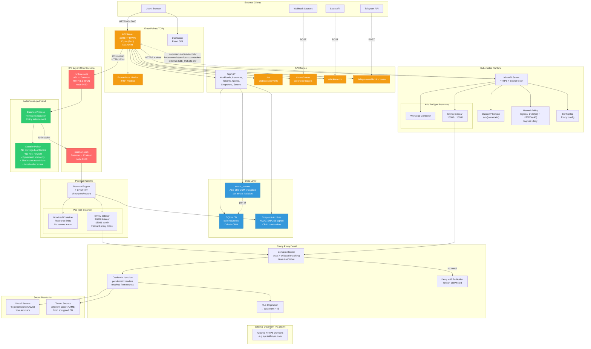

# Boilerhouse Architecture — Pentesting Reference

## System Diagram (Mermaid)



## Network Topology Summary

```
┌──────────────────────────────────────────────────────────────────────┐
│  EXTERNAL NETWORK                                                    │
│                                                                      │
│  [Browser]  [Slack]  [Telegram]  [Webhook Sources]                   │
│      │         │          │              │                            │
│      └─────────┴──────────┴──────────────┘                           │
│                        │                                             │
│                   TCP :3000                                          │
│               ┌────────┴────────┐                                    │
│               │   API SERVER    │  ← NO AUTHENTICATION               │
│               │   (Elysia/Bun)  │  ← NO TLS (designed for internal) │
│               └───┬──────┬──────┘                                    │
│                   │      │                                           │
│          ┌────────┘      └────────┐                                  │
│          ▼                        ▼                                  │
│   ┌─────────────┐         ┌─────────────┐                           │
│   │  SQLite DB  │         │  K8s API    │                           │
│   │  (secrets,  │         │  (HTTPS +   │                           │
│   │   state)    │         │   token)    │                           │
│   └─────────────┘         └─────────────┘                           │
│          │                        │                                  │
│   Unix Socket                     │                                  │
│   (runtime.sock)                  ▼                                  │
│          ▼                 ┌──────────────┐                          │
│   ┌──────────────┐         │  K8s Pods    │                          │
│   │  podmand     │         │ ┌──────────┐ │                          │
│   │  daemon      │         │ │Workload  │ │                          │
│   └──────┬───────┘         │ │Container │ │                          │
│          │                 │ ├──────────┤ │                          │
│   Unix Socket              │ │Envoy     │──── → Allowed HTTPS hosts │
│   (podman.sock)            │ │Sidecar   │ │    (credential inject)  │
│          ▼                 │ └──────────┘ │                          │
│   ┌──────────────┐         └──────────────┘                          │
│   │  Podman      │                                                   │
│   │ ┌──────────┐ │                                                   │
│   │ │Workload  │ │                                                   │
│   │ │Container │ │                                                   │
│   │ ├──────────┤ │                                                   │
│   │ │Envoy     │──── → Allowed HTTPS hosts (credential inject)      │
│   │ │Sidecar   │ │                                                   │
│   │ └──────────┘ │                                                   │
│   └──────────────┘                                                   │
└──────────────────────────────────────────────────────────────────────┘
```

## Attack Surface Inventory

### 1. Network Entry Points

| Entry Point | Port | Protocol | Auth | Notes |
|---|---|---|---|---|
| REST API | 3000 | HTTP | **NONE** | All CRUD operations exposed |
| WebSocket | 3000 | WS | **NONE** | Real-time event stream |
| Webhook triggers | 3000 | HTTP POST | **NONE** | `/hooks/:name` — arbitrary trigger |
| Slack events | 3000 | HTTP POST | Slack signature? | `/slack/events` |
| Telegram webhook | 3000 | HTTP POST | Token in URL | `/telegram/webhooks/:token` |
| Prometheus metrics | 9464 | HTTP | **NONE** | Operational data leak |
| Envoy admin | 18081 | HTTP | **NONE** | Per-container, internal |

### 2. IPC / Socket Entry Points

| Socket | Protocol | Permissions | Risk |
|---|---|---|---|
| `runtime.sock` | HTTP/JSON over Unix | 0660 | API→Daemon command channel |
| `podman.sock` | HTTP over Unix | 0600 | Full Podman API access |
| K8s service account token | File read | Pod mount | Cluster API access |

### 3. Data Stores

| Store | Type | Encryption | Risk |
|---|---|---|---|
| `boilerhouse.db` | SQLite | Secrets: AES-256-GCM | Key in env `BOILERHOUSE_SECRET_KEY` |
| Snapshot archives | Files | HMAC-SHA256 integrity | CRIU memory dumps |
| ConfigMaps (K8s) | K8s resource | None | Envoy config with credential refs |

### 4. Credential Material

| Credential | Location | Protection |
|---|---|---|
| `BOILERHOUSE_SECRET_KEY` | Env var | 32-byte hex, encrypts all tenant secrets |
| `K8S_TOKEN` | Env var or mounted file | Bearer token for K8s API |
| `K8S_CA_CERT` | Env var | CA for K8s TLS validation |
| Tenant secrets | SQLite (encrypted) | AES-256-GCM per-secret IV |
| Global secrets | Env vars | Plaintext in process memory |
| Slack/Telegram tokens | Trigger config in DB | Not encrypted (stored as config) |

### 5. Key Attack Vectors

#### A. Unauthenticated API Access
- **Risk**: Critical — no auth on any endpoint
- **Impact**: Full workload CRUD, tenant claim/release, secret management
- **Boundary**: Network isolation is the only control

#### B. Tenant Secret Extraction
- **Vector**: `GET /api/v1/tenants/:id/secrets` lists names; secrets resolved at proxy config time
- **Vector**: Compromise `BOILERHOUSE_SECRET_KEY` → decrypt all tenant secrets
- **Vector**: Read Envoy sidecar config (ConfigMap or generated file) → resolved credentials in headers

#### C. Container Escape
- **Vector**: CRIU checkpoint contains full process memory → sensitive data in snapshots
- **Vector**: Podman pod shared network namespace → sidecar bypass
- **Vector**: Bind mount misconfiguration → host filesystem access

#### D. Envoy Proxy Bypass
- **Vector**: Domain allowlist wildcard handling edge cases
- **Vector**: HTTP CONNECT tunneling to non-allowlisted hosts
- **Vector**: Direct outbound if `network.access` not set to `restricted`
- **Vector**: Admin endpoint (:18081) accessible from workload container

#### E. Webhook/Trigger Abuse
- **Vector**: Unauthenticated webhook replay → trigger arbitrary workload claims
- **Vector**: Slack event forgery (verify signature validation exists)
- **Vector**: Telegram token enumeration via `/telegram/webhooks/:token`
- **Vector**: Cron job injection via trigger API

#### F. Kubernetes Cluster Compromise
- **Vector**: Service account token with broad permissions
- **Vector**: NetworkPolicy bypass (egress to DNS allows DNS tunneling)
- **Vector**: ConfigMap containing resolved credentials readable by other pods
- **Vector**: Pod-to-pod communication within namespace

#### G. Unix Socket Exploitation
- **Vector**: If socket permissions weakened → direct daemon commands
- **Vector**: `runtime.sock` (0660) accessible to group members
- **Vector**: No authentication on socket protocol — anyone with file access has full control

#### H. Snapshot/CRIU Attacks
- **Vector**: HMAC key (`hmacKey`) compromise → forge/tamper snapshots
- **Vector**: Snapshot archives contain process memory → credential extraction
- **Vector**: Restore tampered snapshot → code execution

### 6. Trust Boundaries

```
┌─ UNTRUSTED ──────────────────────────────────────┐
│  External HTTP clients, webhook sources,          │
│  Slack/Telegram APIs                              │
├─ TRUST BOUNDARY: Network perimeter ──────────────┤
│  API Server (no auth — trusts all network peers)  │
├─ TRUST BOUNDARY: Unix socket permissions ────────┤
│  boilerhouse-podmand daemon                       │
├─ TRUST BOUNDARY: Socket permissions (0600) ──────┤
│  Podman engine                                    │
├─ TRUST BOUNDARY: Container isolation ────────────┤
│  Workload containers (untrusted code)             │
├─ TRUST BOUNDARY: Envoy proxy ────────────────────┤
│  External HTTPS upstream services                 │
└──────────────────────────────────────────────────┘
```

### 7. Ports & Protocols Summary

| Component | Port | Protocol | Direction | Auth |
|---|---|---|---|---|
| API | 3000 | HTTP/WS | Inbound | None |
| Prometheus | 9464 | HTTP | Inbound | None |
| Envoy proxy | 18080 | HTTP | Container→proxy | None |
| Envoy admin | 18081 | HTTP | Internal | None |
| K8s API | 443/6443 | HTTPS | Outbound | Bearer token |
| Workload exposed | Ephemeral | TCP | Inbound | App-defined |
| DNS (K8s egress) | 53 | UDP/TCP | Outbound | None |
| HTTPS upstream | 443 | HTTPS | Outbound (via proxy) | Injected headers |
